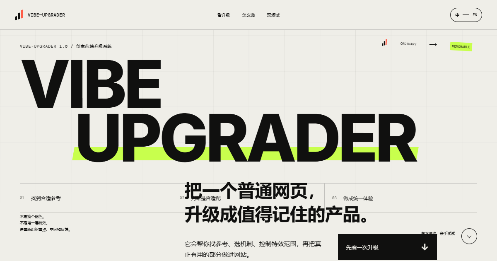

# Vibe-Upgrader Showcase

An interactive product story for [Vibe-Upgrader 1.0](https://github.com/Zeno-wistom/vibe-upgrader): a UI/UX, visual, and interaction upgrade Skill for real frontend projects.

[Open the production showcase →](https://vibe-upgrader-showcase.vercel.app/)



## What the demo covers

- A draggable before/after comparison that makes the upgrade legible.
- A plain-language Standard versus Experimental track switcher.
- A decision-flow interaction for reference retrieval, candidate evaluation, custom fallback, verification, and the human gate.
- A mechanism lab that combines hierarchy, feedback, and responsive motion without stacking unrelated effects.
- Chinese and English content, responsive layouts, keyboard-operable controls, and reduced-motion fallbacks.

## Run locally

```bash
npm install
npm run dev
```

Create a production build with:

```bash
npm run build
```

## Production

The Vercel project is deployed at [vibe-upgrader-showcase.vercel.app](https://vibe-upgrader-showcase.vercel.app/). The site is a Vite/React single-page experience whose internal navigation uses stable section anchors.

## License

Original showcase code is available under the [MIT License](./LICENSE). Product names and third-party references remain the property of their respective owners.
